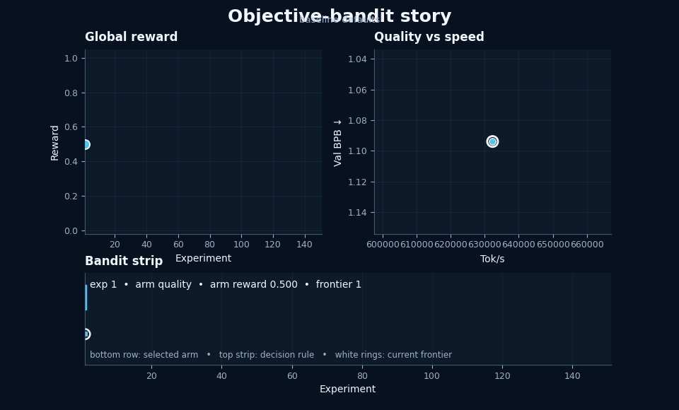

# autoresearch-bandit



This is the objective-arm, multi-objective bandit version of autoresearch.

The original autoresearch loop hill-climbs a single metric: `val_bpb`. That is useful, but it collapses several real LLM tradeoffs into one number. In practice, model work usually tries to improve several things at the same time: quality, throughput, VRAM footprint, model size, and inference cost. This variant keeps the same fixed-time training setup, but changes the outer loop so the agent explores those tradeoffs explicitly.

## Core idea

A bandit arm here is **not** a code subsystem like optimizer or attention. A bandit arm is a **research objective**.

The 4 implemented objective arms are:

- `quality`  → lower `val_bpb`
- `speed`    → higher `steady_tok_per_sec`
- `memory`   → lower `peak_vram_gb`
- `cost`     → lower `num_flops_per_token_G`

The agent may edit code **anywhere in the repo** to improve the chosen objective arm. The arm is the hypothesis label, not a file restriction.

## What stays fixed

For comparability, these items should stay fixed during a run:

- dataset and split
- tokenizer and tokenizer training
- validation harness and `evaluate_bpb`
- fixed wall-clock training budget
- the reward equations used by the controller
- the results schema used by the summary scripts
- number of parameters

Everything else can be changed: model architecture, optimizer logic, scheduling, kernels, helper files, code organization, and any new modules the agent wants to add.

## How the outer loop works

There are two independent pieces of logic.

First, the **bandit** chooses which objective arm should get the next experiment. It uses UCB1 over historical arm rewards.

Second, the **archive** decides whether the resulting run should be kept. A run is kept if it lies on the observed Pareto frontier over the 5 raw metrics.

That means the workflow no longer has one single "best commit". It has an archive of frontier commits, each representing a different tradeoff point.

## Reward model

The first successful run is the baseline.

Each raw metric is normalized to a score in `[0, 1]` relative to that baseline:

- quality score from `val_bpb`
- speed score from `tok_per_sec`
- memory score from `memory_gb`
- cost score from `flops_per_token_g`

The global multi-objective reward is:

```text
global_reward =
    0.40 * quality_score +
    0.25 * speed_score   +
    0.20 * memory_score  +
    0.15 * cost_score
```

The bandit update uses an arm-specific reward:

```text
arm_reward = 0.65 * selected_objective_score + 0.35 * global_reward
```

So if the chosen arm is `memory`, the bandit mostly cares about whether memory improved, but it still gets partial credit for improving the overall tradeoff picture.

Crashes get zero reward.

## Keep / discard rule

A successful run is `keep` if it is non-dominated on the 4D frontier:

- minimize `val_bpb`
- maximize `tok_per_sec`
- minimize `memory_gb`
- minimize `flops_per_token_g`

Otherwise it is `discard`.

A crash is `crash`.

## Files in this variant

- `train_bandit.py` — training script with richer machine-readable telemetry at the end of each run
- `bandit_controller.py` — selects the next objective arm, selects a parent frontier commit, computes rewards, and appends `results.tsv`
- `summarize_bandit.py` — generates a static dashboard PNG and an animated GIF
- `program_bandit.md` — operational instructions for an autonomous coding agent
- `results_bandit_template.tsv` — header template for the results file

## Git workflow

Because there are multiple kept frontier points, do not rely on a single moving branch tip.

When a run is kept, create a lightweight tag such as:

```bash
git tag -f frontier-exp-0012 <commit>
```

Later experiments can branch from whichever frontier commit best matches the chosen objective arm.

## Main summary figure

The default summary figure in this variant is a dashboard rather than a single scalar trace. It includes:

- global multi-objective reward by experiment with a running-best line
- quality vs speed scatter, with marker size encoding VRAM and color encoding objective arm
- running-best normalized score for each objective
- objective-arm pull counts and mean arm reward
- a current-frontier summary card
- an objective-arm timeline heatmap

The GIF is the same dashboard animated over time, one experiment at a time.

## Quick start

```bash
# 1. Prepare the tokenizer and data once
uv run prepare.py

# 2. Initialize the results file
python bandit_controller.py init --results results.tsv

# 3. Run one baseline experiment
AUTORESEARCH_OBJECTIVE_ARM=quality uv run train_bandit.py > run.log 2>&1

# 4. Append the run
python bandit_controller.py append \
  --results results.tsv \
  --log run.log \
  --commit "$(git rev-parse --short HEAD)" \
  --objective-arm quality \
  --description "baseline"

# 5. Generate the dashboard and GIF
python summarize_bandit.py results.tsv \
  --png bandit_progress.png \
  --gif bandit_progress.gif
```

## Planner helper

To ask the controller what to do next:

```bash
python bandit_controller.py next-plan --results results.tsv
```

It returns JSON describing:

- the next objective arm
- the parent frontier commit to branch from
- why those choices were made

## Notes on objective choice

These 5 objectives were selected because they are available from the existing run summary and are useful across training and deployment tradeoffs.

Other good objectives exist, but they are not implemented here by default because they require extra evaluation machinery per run, for example:

- benchmark suites
- long-context evals
- sample quality judgments
- latency measurements on a serving stack
- safety / refusal / hallucination scoring

Those can be added later if the fixed contract is expanded.
